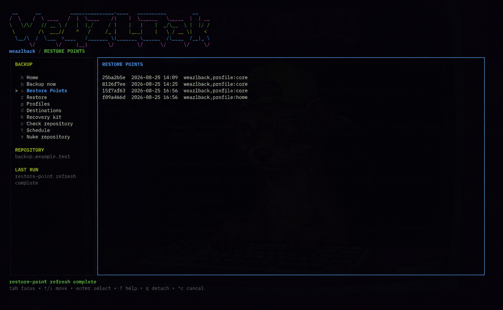

# WeazlBack: Sovereign Backup

### Real Encryption, Full Control

```text
 __      __                   .__ ___.                  __
/  \    /  \ ____ _____  ____ |  |\_ |__ _____    ____ |  | __
\   \/\/   // __ \\__  \ \___ \|  | | __ \\__  \ _/ ___\|  |/ /
 \        /\  ___/ / __ \_/    >  |_| \_\ \/ __ \\  \___|    <
  \__/\  /  \___  >____  /_____ \____/___  (____  /\___  >__|_ \
       \/       \/     \/      \/        \/     \/     \/     \/
SIGNAL // IMMUTABLE // BARE METAL
```



Cloud backup is just somebody else's hard drive charging you rent to scan your files. Weazlback is the exploit. It is a fast, sovereign disaster-recovery TUI built strictly for Omarchy Quattro.

The architecture cuts the cord entirely. You get encrypted local and SFTP repositories powered by Restic, a passphrase-encrypted local vault, and live Bubble Tea progress meters grinding in the terminal. No Electron bloat. No telemetry. Just content-addressed Restic Restore Points—not block-device snapshots—locked under paranoid local encryption, complete with selective file recovery, versioned app manifests, and password-locked recovery kits.

## Install

Build and install the application, restore binary, Omarchy widget, and user services:

```sh
./scripts/install.sh
```

The installer does not initialize a vault or repository. Start `weazlback`, create the sovereign vault, then configure a local or SSH target from **Destinations**.

## TUI-First Mechanics

The GUI is a crutch. Weazlback is terminal-native and keyboard-driven.

* **Navigation:** `Tab` shifts focus to the navigation rail; `Shift+Tab` drops you back into the payload.
* **Session State:** The `weazlback-session` backend keeps one vault-owning process alive in a `tmux` session. Hit `q` to detach the visible terminal and let the backup grind in the background without taxing the gig.
* **Cancellation:** `Ctrl+C` is your explicit kill switch, but the widget demands absolute confirmation before aborting the job.
* **Lockdown:** An explicit quit-and-lock terminates the process and wipes the in-memory key clean.

Selective recovery lets you search or browse a Restore Point, extract it into private staging, verify the vector, and explicitly confirm it before Weazlback overwrites your live metal.

## The Omarchy Quattro Widget

The schema-v1 bar widget flies the floppy glyph ``. Left-click cracks open the compact tactical backup/status panel; right-click drops into Travel Mode.

Routine backups run Core and Home concurrently with separate progress lanes. Security is absolute: the vault passphrase is piped straight to the binary over `stdin`—it never touches `argv` or the environment. The key stays alive only for the current Omarchy shell session, until you hit **Lock vault**, reload or exit the shell, or log out. Widget status is sanitized local JSON; true Restic diagnostics are retained purely as vault-keyed ciphertext under `~/.weazlback/logs` with the latest 50 retained.

An hourly user timer enforces the perimeter. It checks whether your last healthy Core + Home backup is seven days old, respects the 59% battery floor, preserves your stay-awake state, and absolutely refuses to prune unattended.

### The Sandbox and Uninstallation

The installer stages user-owned plugin files, bounces the shell to rescan, enables the widget, and records the binary path. It calls exactly what it needs: `restic`, `ssh-agent`/`ssh-add`, `sudo` only after visible UI authorization, `pkexec`, `notify-send`, and `tmux`.

Nuke the plugin interface without deleting your vaults or working binaries:

```sh
omarchy plugin disable io.github.bprendie.weazlback
omarchy plugin remove io.github.bprendie.weazlback
```

To rip out the timer and widget while preserving the vault, encrypted logs, repositories, recovery media, and working binaries, run:

```sh
weazlback-uninstall
```

## Forge the Binary and Run Drills

```sh
go test ./...
go build -o ./weazlback ./cmd/weazlback
go build -o ./weazlback-restore ./cmd/weazlback-restore
./weazlback doctor
./weazlback init --name local --repository /mnt/weazlback/repository
./weazlback backup --profile core
./weazlback heavy inspect
./weazlback backup --profile heavy
./weazlback list
./weazlback files --snapshot latest --query api-keys
./weazlback restore --snapshot latest --target /private/staging --include /home/me/file
./weazlback check
./weazlback recovery export --output /mnt/weazlback/weazlback-recovery.wzrk
./weazlback inventory --output ./weazlback-inventory.json
./weazlback applications --output /secure/path/applications.json
./weazlback benchmark --engine borg --fixture all
./weazlback benchmark --engine restic --fixture all
```

To run the retained benchmark harness on Omarchy: `omarchy pkg add borg restic`.

## Prime Vector Nugs: The Heavy Lane

Heavy data is a separate, deduplicated lane exclusively for VM and container assets. Weazlback is merciless here: before firing a Heavy backup, it sweeps the configured roots for writable open files. If a VM or container is live, it hard-refuses the capture. Stop the workload and retry. There is no unsafe override.

Restores use sparse-file extraction. Pruning Heavy retention—7 daily, 4 weekly, and 3 monthly by default—requires explicit confirmation:

```sh
weazlback prune --profile heavy          # preview only
weazlback prune --profile heavy --apply  # requires PRUNE <repository ID>
```

## Vault Rule: No Lifeguard on Duty

Any non-empty passphrase is accepted. There is no strength policy, and there is zero lost-passphrase recovery. Losing your passphrase permanently nukes your access to all encrypted backups and `.wzrk` recovery kits. Back up your metal.

## The Recovery Kit (.wzrk)

Your backups stay in their encrypted repositories. The recovery USB is not a bloated copy of those backups—it is the raw bootstrap bundle that lets a fresh Omarchy install find, unlock, and restore the prime data.

The USB packs:

* `weazlback-restore`: Starts recovery even if Weazlback is not installed on the new rig.
* `weazlback-recovery.wzrk`: Holds every configured repository location, pinned SSH host key, private SSH credential, and repository secret inside a second encrypted envelope. Recovery lets you choose which destination to use.
* The raw `weazlback` binary, offline docs, and SHA-256 checksums.
* A verified Restic binary to bypass network package mirrors.

**The `.wzrk` file does not contain your vault passphrase.** A stolen USB is a brick without it; a lost passphrase means the USB and backup are permanently inaccessible. Keep at least two physical copies physically separated from the target rig.

To cut a new kit to an existing writable folder—Weazlback never formats or erases the drive—run:

```sh
weazlback recovery prepare --target /mnt/WEAZLBACK-RECOVERY
```

### Break-Glass Destruction

If a repository is compromised, the recovery folder provides a cryptographic destruction path, even if the local index is damaged:

```sh
./weazlback-restore --recovery ./weazlback-recovery.wzrk --nuke-repository
```

This demands the vault passphrase and the exact phrase `NUKE <repository ID>`. The default scorches the repository data and its keys. Append `--nuke-keys-only` to intentionally strand inaccessible ciphertext.

## Restoration Field Guide

There are two recovery vectors. **Restore Mode** handles deleted files, bad edits, application drift, and point-in-time rewinds while the machine is alive. **Fresh System Recovery** rebuilds a clean Omarchy installation from prepared USB media. Same encrypted repository. Different blast radius.

### Restore Mode: The Rig Still Boots

Open Weazlback from the widget, focus the navigation rail with `Tab`, and press `R`. The entire TUI switches into the restore workspace; press `B` from its dashboard to return to backup operations. The widget's **Restore files** action lands in the same persistent `tmux` backend, so closing the terminal does not vaporize an active transaction.

The dashboard exposes five recovery tools:

* **Browse history (`f` or `Enter`):** Walk one Restore Point as a filesystem tree. `Right` or `Enter` descends into a directory; `Left` climbs toward `/`; `↑` and `↓` move the cursor.
* **Search (`/`):** Fuzzy-search filenames across known timestamps. Results show the same path once with its available version dates, instead of burying you in duplicate filenames.
* **Path mode (`/p PATH`):** Jump straight to a known location such as `/p ~/Pictures/wallpapers`. An exact directory opens the tree there; a partial path filters inside the selected Restore Point.
* **Bundle restore (`g`):** Restore System Config, Personal Files, Heavy data, or a selected combination around a requested time.
* **Applications (`a`):** Reconcile the selected machine's package and service manifest without touching filesystem bundles.

The browser always identifies the source machine and exact Restore Point at the top. Use `i` to cycle machine identities, `[` and `]` to move through time, and `A` when a filename may exist on another rig. `H` expands a path search across its catalogued history. Deleted paths are marked in orange; yellow is selection, not danger.

Press `Space` to add files or directories to the restore basket. Every basket item remains pinned to the machine and Restore Point where you selected it, even if you keep browsing through time. Press `e` to execute the basket, then choose where the payload lands:

* **Original path:** Put it back where it lived, mapping the source home into the current user's home.
* **Private staging:** Extract and validate it without touching live files.
* **Alternate directory:** Redirect the payload somewhere you control.

Existing live objects are preserved for rollback before replacement. Weazlback stages, validates, journals, and then places the batch as one transaction—you do not approve a thousand files one at a time. If placement fails, the encrypted resumable journal records exactly where the grind stopped.

### Bundle Restore: Reset the Clock

**Safe Overlay** is the daily-driver option. It restores the selected bundle, preserves rollback copies of conflicts, and leaves unrelated live files alone.

**Exact Rewind** makes selected boundaries match the chosen point in time, including removing paths proven absent then. That is deliberately destructive. Weazlback shows the deletion queue, warns that missing or corrupt files are possible, offers to capture a quick current-state backup, and requires an explicit `YES` acknowledgement before it fires. If you are merely recovering a lost file, use the basket—not the orbital cannon.

Restore Points are composed honestly. You choose the anchor time; Core, Home, and Heavy resolve to their nearest healthy points, and the final plan discloses every actual timestamp before anything mutates the machine.

### Fresh System Recovery: Bare Metal, No Installed Weazlback

Install Omarchy normally, mount the prepared recovery USB, open a terminal in its folder, and verify the payload before touching the vault:

```sh
cd /mnt/WEAZLBACK-RECOVERY
sha256sum -c SHA256SUMS
./weazlback-restore
```

Prepared media also verifies `SHA256SUMS` automatically when the guided interface starts. Any mismatch hard-stops before the `.wzrk` file or repository credentials are opened. Do not freestyle around a failed checksum; recut the kit from a trusted machine.

The guided recovery flow asks for these decisions in order:

1. **Recovery kit and vault passphrase.** This unlocks the `.wzrk` envelope in memory. The passphrase is never stored on the USB.
2. **Destination.** Choose any local or SSH repository embedded in the kit. An SSH target needs storage and SSH/SFTP access; Restic runs from the recovery media, not on the target.
3. **Source machine.** Pick the laptop or desktop whose history you intend to restore. Machine identities share repository deduplication without bleeding manifests into one another.
4. **Target identity.** Keep the fresh installation's identity, generate a new independent identity, or explicitly adopt the source identity when this is replacement hardware.
5. **Restore Point and action.** Restore a bundle, applications only, one selected path, or build the optional encrypted history catalog.
6. **Hostname.** Keep the fresh hostname, inject a new one, or restore the original for applications such as Chromium that bind state to the machine name.
7. **Final plan.** Review the precise Core, Home, Heavy, package, service, identity, and hostname operations before authorizing the run.

Recovery scopes are intentionally blunt and legible:

* **Core:** Settings, dotfiles, widgets, Weazl apps, application manifests, services, and hostname—the fastest path back to a usable rig.
* **Home:** Core plus normal home files. This is the recommended fresh-system restore.
* **Everything:** Core, Home, and the Heavy lane containing VMs and container assets.
* **Applications:** Reconciles the chosen identity's package and service manifest without placing filesystem bundles.
* **Selective:** Browses one Restore Point immediately and restores one file or directory through the same rollback-preserving transaction engine. Building the cross-time catalog is optional.

Filesystem placement and application reconciliation run in parallel. Slow AUR builds do not hold your home directory hostage, and the interface shows independent progress lanes. Package conflicts, unavailable services, and manual-review items are exceptions—not permission to pretend the restore was clean. The final journal tells you what landed and what still needs human judgment.

For a zero-mutation drill, use the explicit inspection flags:

```sh
# Unlock, verify repository access, and print the exact plan
./weazlback-restore --recovery ./weazlback-recovery.wzrk --plan-only

# Decrypt and validate Core into private staging only
./weazlback-restore --recovery ./weazlback-recovery.wzrk --stage-only
```

Run these drills before disaster day. A recovery kit you have never bootstrapped is a theory, not a backup strategy.

## Flow State Tuning

Weazlback defaults to 4 parallel connections for I/O. Do not guess your throughput—measure it. Run `weazlback tune` after a representative Core backup. It benchmarks 2, 4, and 10 repository connections, prints the results, and asks which value to save.

The same guided workflow is available from **Tune** in the main TUI, with an animated connection-test lane and a live bandwidth bar.

For an SSH destination, tuning then streams 100 MiB of ephemeral cryptographic random data into a uniquely named remote probe file, measures sustained end-to-end bandwidth, deletes the probe, and recommends a 79% aggregate upload ceiling. You choose the final ceiling; `0` means unlimited. Probe data never enters a Restic Restore Point or touches local storage.

Automatic tuning treats tiny timing differences as noise. Override either control when you know the link better than the benchmark does:

```sh
# Pin repository concurrency while leaving the existing upload guard unchanged
weazlback tune --connections 10

# Pin both values; the upload ceiling is aggregate, not per connection
weazlback tune --connections 10 --upload-limit-mib 79

# Return an SSH destination to unlimited upload
weazlback tune --connections 10 --upload-limit-mib 0
```

Each destination keeps its own connection count and upload ceiling. Local repositories remain unlimited unless their storage path imposes its own limits.
